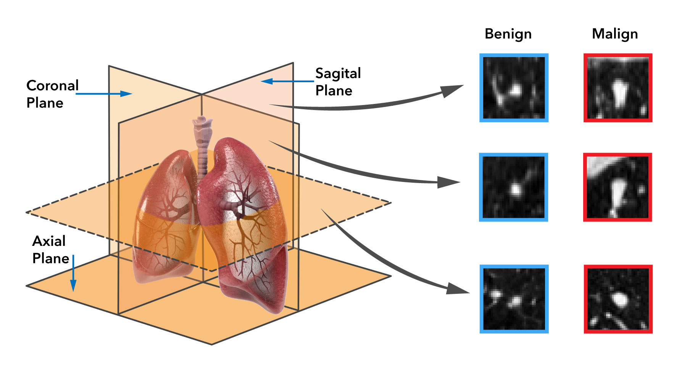

# QTMLforBiomedicalImages_ComparativeStudy
Quantum Machine Learning in Biomedical Applications: A Comparative Study. 

---

# Quantum Machine Learning in Biomedical Applications: A Comparative Study

## Authors
- Xavi F. Aragones¹²
- Miguel A. González Ballester¹³⁴

### Affiliations
1. BCN Medtech, Dept. of Engineering, Universitat Pompeu Fabra, Barcelona, Spain
2. Parc Tecnològic TecnoCampus Mataró-Maresme - UPF, Spain
3. Quantic, Barcelona Supercomputing Center, Barcelona, Spain
4. ICREA, Barcelona, Spain

## Introduction
Quantum Machine Learning (QML) has emerged as a promising paradigm, offering significant potential for applications in biomedicine. The accessibility and democratization of various quantum computing simulation tools have facilitated a smoother transition from classical machine learning to QML. This paper focuses on analyzing a classical image classification problem, with a particular emphasis on the use of real medical images, such as those used for recognizing malignant tumors in CT scans [1]. The primary contribution of this work is a comprehensive comparison of different QML software frameworks and the investigation of classical data encoding within fully quantum and hybrid quantum frameworks.

## Methods
This study explores two prominent approaches commonly employed in quantum image processing: quantum image encoding techniques and classical image data encoding for quantum processing. The first approach utilizes quantum image encoding techniques, such as Flexible Representation of Quantum Images (FRQI) [2] and Novel Enhanced Quantum Representation (NEQR) [3], to leverage their inherent advantages.

The second approach treats images as classical data, deploying various encoding strategies, including:
- Amplitude encoding
- Angle encoding
- ZZ feature map

To address the limitations posed by quantum resource constraints, dimensionality reduction techniques were integrated:
- Principal Component Analysis (PCA)
- 2D Discrete Cosine Transform (DCT2)

Variational Quantum Classifiers (VQCs), Quantum Neural Network (tested on Pennylane), Quantum circuit ANSATZ (tested on Qiskit) and Quantum Support Vector Machines (QSVMs) were employed as the primary quantum classification techniques [4,5].

## Results
Among the implemented quantum classification techniques, the Quantum Support Vector Machine demonstrated superior performance compared to other methods, including Quantum Neural Networks (QNNs) and hybrid architectures. This indicates the potential of QSVM in achieving higher accuracy and efficiency in the classification of medical images, highlighting their applicability in real-world biomedical scenarios.

### Performance Results

## PCA (n = 10)

| Embedding  | Coronal Avg. Acc. | Sagittal Avg. Acc. | Axial Avg. Acc. |
|-----------|-------------------|-------------------|-----------------|
| Amplitude | 0.813 (±0.054)    | 0.768 (±0.044)    | 0.757 (±0.035)  |
| Angle     | **0.841** (±0.031)| 0.766 (±0.039)    | 0.787 (±0.023)  |
| ZZFeatMap | 0.804 (±0.038)    | 0.793 (±0.031)    | 0.822 (±0.032)  |

## DCT2 (n = 10)

| Embedding  | Coronal Avg. Acc. | Sagittal Avg. Acc. | Axial Avg. Acc. |
|-----------|-------------------|-------------------|-----------------|
| Amplitude | 0.764 (±0.050)    | 0.762 (±0.037)    | 0.742 (±0.034)  |
| Angle     | 0.786 (±0.030)    | 0.760 (±0.019)    | 0.770 (±0.022)  |
| ZZFeatMap | 0.771 (±0.033)    | 0.760 (±0.033)    | 0.733 (±0.029)  |

## Conclusions

### Key findings:
- **Quantum embeddings**
  - Generally worse performance (FRQI 75.11%, NEQR 61.73%)
  - Long running times on simulator

- **QSVM with PCA**
  - Reported best performance, outperforming DCT2
  - Highest accuracy: 84.1% (angle embedding)

- **Plane-specific patterns**
  - Coronal plane generally showed best accuracy

### Future work:
- Extend comparison benchmark with additional methods
- Run on quantum hardware
- Create open public test bench

## Acknowledgements
This work is part of Maria de Maeztu Units of Excellence Programme CEX2021-001195-M, funded by MICIU/AEI /10.13039/501100011033

## References
[1] Armato III, S.G. et al. The lung image database consortium (LIDC) and image database resource initiative (IDRI) . Medical Physics 38(2):915-931, 2011. 
[2] Le, P.Q. et al. A flexible representation of quantum images for polynomial preparation, image compression, and processing operations. Quantum Information Processing 10(1):63–84, 2010
[3] Zhang, Y. et al. NEQR: A novel enhanced quantum representation of digital images. Quantum Information Processing 12(8):2833–2860, 2013.
[4] Combarro & Gonzalez-Castillo, S. A Practical Guide to Quantum Machine Learning and Quantum Optimisation: Hands-On Approach to Modern Quantum Algorithms, 2023.
[5] Schuld, M. Supervised quantum machine learning models are kernel methods, arXiv:2101.11020, 2021

