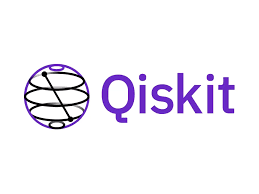

# Quantum Classifiers for Medical Imaging

This repository contains implementations of quantum classifiers applied to medical imaging and quantum image encoding techniques such as Flexible Representation of Quantum Images (FRQI) and Novel Enhanced Quantum Representation (NEQR). 

---

## Introduction: Why Qiskit?

Using Qiskit Framework

This repository leverages the **Qiskit framework**, the world’s most popular software stack for quantum computing. Qiskit provides a robust and versatile platform for building quantum circuits, leveraging built-in quantum functions, optimizing execution with AI tools, and running quantum workloads efficiently in a streamlined runtime environment.

### Why Choose Qiskit?
1. **Comprehensive Software Stack**: Qiskit offers tools for all stages of quantum computing, from circuit creation to execution on IBM Quantum devices.
2. **Optimized for Performance**: Qiskit’s transpiler optimizes circuits for specific hardware, reducing execution errors and runtime.
3. **Device Flexibility**: It supports a range of IBM Quantum hardware and simulators, enabling seamless experimentation on cutting-edge quantum devices.
4. **AI-Powered Optimization**: Leverage AI tools integrated into the Qiskit runtime for enhanced circuit execution and optimization.
5. **Extensive Community and Documentation**: With a thriving global community and detailed documentation, Qiskit makes it easy for researchers and developers to adopt and excel in quantum computing.

By using Qiskit, this project benefits from IBM’s state-of-the-art quantum computing software, tailored to drive innovation in quantum machine learning research.

Please feel free to explore and learn more about this powerful framework by visiting the [official Qiskit website](https://www.ibm.com/quantum/qiskit). There, you'll find comprehensive documentation, tutorials, and resources to get started with quantum computing and quantum machine learning.

## Quantum Classifiers and Image Encoding Techniques

This repository contains resources and examples related to quantum image encoding and quantum classification applied to medical imaging. Below, you will find Google Colab notebooks showcasing specific techniques and evaluations.

---

### Quantum Image Encoding Techniques

Explore how quantum image encoding methods can be applied to medical imaging data. These notebooks demonstrate different quantum encoding approaches:

#### 1. **Evaluation of Quantum Classifiers Using FRQI**
- Description: This notebook implements the Flexible Representation of Quantum Images (FRQI) method to encode medical images for quantum classification tasks.
- [View the Colab Notebook](https://colab.research.google.com/drive/1uIFXvw94QD7Kw8I5gYC0nnhhdrp4ZXab?usp=sharing)

#### 2. **Evaluation of Quantum Classifiers Using NEQR**
- Description: This notebook uses the Novel Enhanced Quantum Representation (NEQR) method, an advanced technique for quantum image encoding.
- [View the Notebook](https://drive.google.com/file/d/1pR95DHy_OlTwUGEij4hP7YyqkcjIA2YO/view?usp=sharing)

---

### Quantum Classification Techniques

These notebooks highlight quantum classification methods applied to medical imaging, leveraging feature extraction techniques such as PCA and DCT2:

#### 1. **Quantum Qiskit with ZZFeatureMap and PCA (Coronal Plane)**
- Description: This notebook applies the ZZFeatureMap method in Qiskit for quantum feature mapping and uses PCA for feature reduction.
- [View the Colab Notebook](https://colab.research.google.com/drive/1VRK2ov-YTuivl-WhKOUFYwqaJ3YKzta0?usp=sharing)

#### 2. **Quantum Qiskit with ZZFeatureMap and DCT2 (Coronal Plane)**
- Description: This notebook explores the combination of ZZFeatureMap and DCT2 (Discrete Cosine Transform) for quantum feature mapping in medical imaging.
- [View the Colab Notebook](https://colab.research.google.com/drive/10SOTcLBeRt1mW3NaQAkI51oGLDtVvNfP?usp=sharing)

---

Feel free to explore these notebooks.
